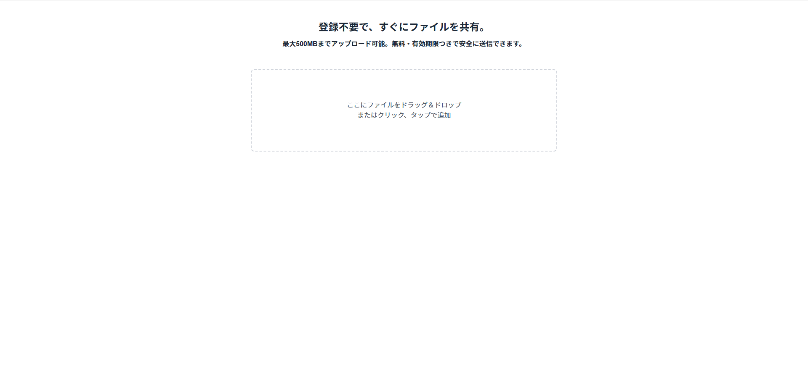
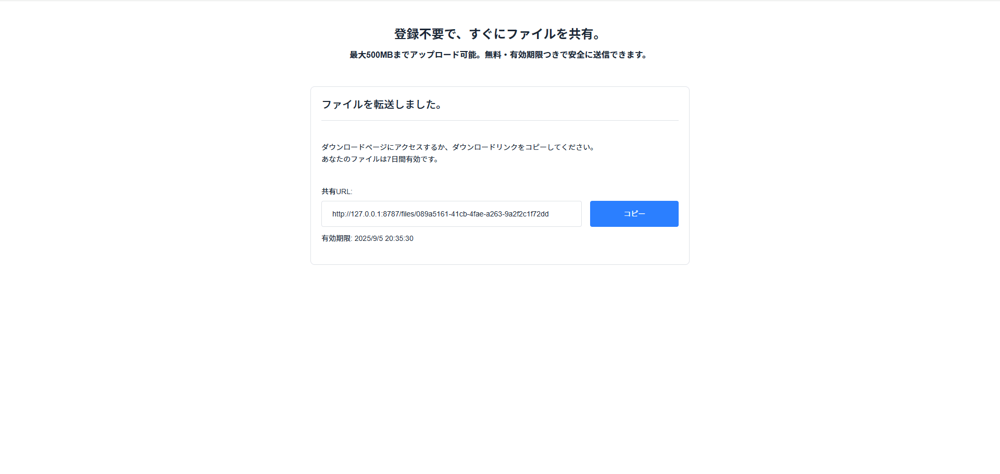

# zip-share-app

## 概要

zip-share-app は、複数ファイルをアップロード・自動でZIP圧縮し、期限付きダウンロードリンクを生成するファイル共有アプリです。  
クライアント側で ZIP 化 → Cloudflare R2 に保存し、メタ情報と有効期限を D1 に記録します。  
Next.js（App Router）+ Hono を Cloudflare Workers 上で動かすサーバーレス構成で、高速かつシンプルな共有体験を実現しています。  
会員登録不要で利用できます。

**URL**：https://zip-share-app.mark-reo.workers.dev/

## アプリケーションのイメージ

| トップ画面 | ファイル追加画面 |
|:--:|:--:|
|  |  |

| URL発行画面 | ダウンロードページ |
|:--:|:--:|
|  |  |

## 開発背景

フロントエンドからエッジ実行環境まで一気通貫で設計・実装できる力を示すため、日常でよく使う「一時的なファイル共有」を題材にしました。  
狙いは、**Cloudflare スタック（Workers / R2 / D1）を実務レベルで使いこなすこと**。  
Wrangler を用いたローカル〜デプロイの流れ、R2 / D1 のバインディング、Hono での API 設計、そして R2 にオブジェクト／D1 にメタ情報という責務分離をまとめて検証しています。  
採用事例が増えており、**低レイテンシ・無料枠の手軽さ・セキュリティ面の利点**が大きいことも選定理由です。  
成果物は **「Next.js × Hono × Cloudflare（Workers / R2 / D1）」の最小テンプレート**として、今後の個人／チーム開発でも流用できるよう整理しています。

## 技術スタック

- フロントエンド：TypeScript / React 19 / Next.js 15（App Router）/ Tailwind CSS v4 / Heroicons
- データベース：Cloudflare D1 + Drizzle ORM
- ストレージ：Cloudflare R2（オブジェクトストレージ）
- API：Hono（Cloudflare Workers）
- アップロード、圧縮：react-dropzone（選択・ドラッグ＆ドロップ）、JSZip（複数ファイルの ZIP 化）
- アクセシビリティ：セマンティック HTML / WAI-ARIA
- デザイン：Figma

## 主な実装機能

- **ファイルアップロード機能**
  - ドラッグ＆ドロップ / クリック・タップでファイル選択可能
  - react-dropzone を使用し、UXを意識した実装

- **複数ファイルの自動 ZIP 圧縮**
  - 2 件以上の選択時はクライアント側で **JSZip** により ZIP 化
  - ワーカーのメモリ負荷を軽減し、アップロード回数を最小化

- **有効期限付き共有リンク生成**
  - 1日 / 3日 / 5日 / 7日から選択可能
  - DB に有効期限を記録し、期限切れアクセスは自動でブロック

- **Cloudflare R2 へのファイル保存**
  - バイナリデータをR2にアップロードし、メタデータはD1へ保存
  - ZIP のときは `application/zip`、それ以外は元の `Content-Type` を付与

- **ファイルダウンロード処理**
  - 固有の `/files/[id]` ページからファイルをダウンロード可能
  - 有効期限チェックや `Content-Type` の制御を行い、安全なレスポンスを提供

- **API 構築（Hono + Cloudflare Workers）**
  - `POST /api/upload`：アップロード＋メタ保存＋URL 返却
  - `GET /api/files/:id`：メタ情報取得
  - `GET /api/download/:id`：期限チェック後にファイル配信

- **Cloudflare D1 + Drizzle ORM によるDB構築**
  - 型安全な schema 定義と migration に対応

- **フロント側のファイル追加のリスト描画**
  - React の list key は配列 index ではなく UUID を採用（並べ替え・削除時の再利用バグ回避）
- **アクセシビリティ対応**
  - セマンティック HTML、ラベルの関連付け、WAI-ARIA 配慮などを実装

## 主なディレクトリ構成

```
├── app/
│   ├── global.css                
│   ├── layout.tsx                
│   ├── page.tsx                    # アップロード画面（メインのフロント画面）
│   ├── api/
│   │   └── [[...route]]/
│   │       └── route.ts            # Hono + Drizzle + Cloudflare Workers による API 定義
│   └── files/[id]/
│       ├── page.tsx                # ダウンロード画面
│       └── client.tsx              # クライアント側のダウンロード処理
├── db/
│   └── schema.ts                   # Drizzle ORM のスキーマ定義（filesテーブル）
├── drizzle/
│   └── migrations/                 # Drizzleによるマイグレーションファイル
│       ├── meta/
│       └── [ランダムな識別子].sql   # 自動生成されるマイグレーションファイル名（例: 0000_xxx.sql）
├── public/
│   └── ...                         # 静的アセット（faviconなど）
├── .env                            # 環境変数（ローカル用・コミット対象外）
├── .env.example                    # 環境変数テンプレート（コミット対象）
├── .gitignore
├── cloudflare-env.d.ts             # Cloudflare 用の型定義（env, DB, R2）
├── drizzle.config.ts               # Drizzle設定ファイル
├── next.config.ts                  # Next.jsの設定ファイル
├── open-next.config.ts             # OpenNextの設定ファイル
├── package.json
├── postcss.config.mjs
├── tailwind.config.ts
├── tsconfig.json
└── wrangler.jsonc                  # Cloudflare Workers 専用設定（D1, R2 を含む） ※Pages未使用
```

Next.js の App Router 構成に加え、Cloudflare Workers（D1 / R2）によるサーバーレス API 処理と、Drizzle ORM による型安全なデータ操作を組み合わせています。

## セットアップ（開発者向け）

前提
- Node.js v20 以上
- Cloudflare アカウントの作成（R2ではクレカ登録が必要）
- Wrangler のインストール（`npm install -g wrangler` または `npm install -D wrangler`）

#### 1.  取得 & 依存関係
```bash
git clone <このリポジトリURL>
cd zip-share-app
npm i
```
#### 2.  Cloudflare ログイン
```bash
npx wrangler login
```

#### 3.  リソース作成（D1 / R2）

**A. このリポジトリの既定名で作る（推奨）**  
wrangler.jsonc の既定と揃うので、そのまま動きます。

```bash
# D1 データベース
npx wrangler d1 create zip-share-app

# R2 バケット
npx wrangler r2 bucket create zip-share-app
```
↑ で出力された `database_id` を、`wrangler.jsonc` の該当箇所へ貼り付けます。  
`bucket_name` は「作成した名前」と一致していれば OK（ID の貼り付けは不要）

```jsonc
// wrangler.jsonc（抜粋）
{
  "d1_databases": [
    {
      "binding": "DB",
      "database_name": "zip-share-app",
      "database_id": "<ここに wrangler の出力 database_id を貼る>"
    }
  ],
  "r2_buckets": [
    {
      "binding": "R2",
      "bucket_name": "zip-share-app"
    }
  ]
}
```
**B. 別名で作る場合**  
任意のプロジェクト名で作ってもOKですが、**wrangler.jsonc** の **database_name / bucket_name** を**同じ名前に揃えてください。**

```bash
npx wrangler d1 create your-project
npx wrangler r2 bucket create your-bucket
```

```jsonc
// wrangler.jsonc（抜粋・別名に揃える）
{
  "d1_databases": [
    {
      "binding": "DB",
      "database_name": "your-project",
      "database_id": "<create の出力 database_id>"
    }
  ],
  "r2_buckets": [
    {
      "binding": "R2",
      "bucket_name": "your-bucket"
    }
  ]
}

```
#### 4.  環境変数 .env を作成

以下を参考にするか、プロジェクト直下の .env.example をコピーして .env を作成してください。 


```env
# Cloudflare Account 
CLOUDFLARE_ACCOUNT_ID=xxxxxxxxxxxxxxxxx

# Cloudflare D1
CLOUDFLARE_DATABASE_ID=xxxxxxxxxxxxxxxxx
CLOUDFLARE_D1_TOKEN=xxxxxxxxxxxxxxxxx

# アプリのベースURL（必ず preview の出力と同じもの）
# 例: Windows → http://127.0.0.1:8787 / macOS → http://localhost:8787
BASE_URL=http://127.0.0.1:8787
```

※.env.example はテンプレートとしてリポジトリに含めています。  
.gitignore により `.env` と `.env*.local` はコミット対象外です。

#### 5. DB 反映（Drizzle → D1）
```bash
npm run db:push
```

#### 6. プレビュー起動（Workers 経路で本番同等に動作）
```bash
npm run preview
```

メモ：UI の動作確認だけなら npm run dev でもOK。R2/D1 を伴うアップロードは preview 推奨です。  

#### 7. デプロイ（任意）
```
npm run deploy
```

<br>

<details> <summary><strong>このリポジトリを使わず最小構成で試す（オプション）</strong></summary>

このリポジトリをクローンせずに、「OpenNext × Cloudflare」の構成で、ゼロから動作・構築をしたい方向けです。


1. Wrangler ログイン
 ```bash
   npx wrangler login
 ```

2. Next.js を Cloudflare テンプレートで作成

```bash
npm create cloudflare@latest -- my-next-app --framework=next
cd my-next-app
npm i
```

3.  OpenNext を採用（本リポと同様のビルド／プレビュー）

```bash
npm run preview
```
</details>

## 補足事項 （Windows でOpenNextを使う場合）

WSL2（Ubuntu）上での実行を推奨します。ネイティブ Windows だと、OpenNext + Cloudflare Workers のローカル検証でパス解決やファイル監視差異が原因のエラーに遭遇する場合があります。  
既知の不具合回避としてツールのバージョンを下げる対応は基本非推奨です。まずは WSL2 を利用する構成をご検討ください。  
macOS 環境がある場合は、**macOS での構築・検証を推奨**します。


## 使い方（利用者向け）

1. トップページでファイルをドロップまたは選択
2. 有効期限を選択
3. 「アップロード」ボタンを押すと、ZIP圧縮 → アップロード完了後に URL が表示される
4. 表示された URL をコピーして共有したい相手に共有
5. URL にアクセスすることでファイルをダウンロード可能（期限付き）

## 今後の改善

期限切れファイルの自動削除（Cron Triggers）を実装しようと考えています。  
D1 の `expiresAt` を基準に Cloudflare Workers の Cron を定期実行し、R2 のオブジェクト削除 → 対応する D1 レコードのクリーンアップを自動化します。  
R2 の Lifecycle ルールは「アップロードからの経過日数」基準のため、 **可変 TTL（1/3/5/7日）** に正確に対応できる本方式を採用予定です。

## ライセンス
このプロジェクトは MIT License のもとで公開されています。